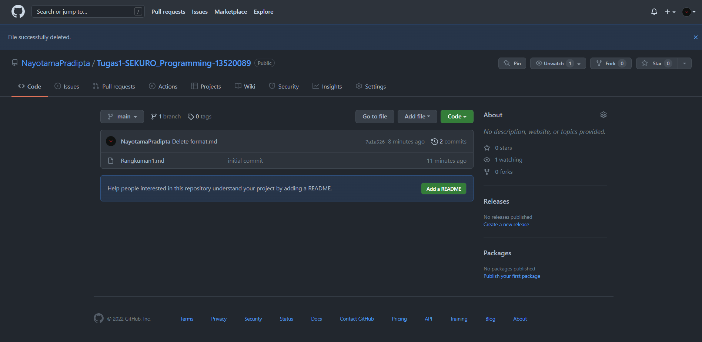

## Working with Github 

Sign up/Login terlebih dahulu ke dalam Github untuk menggunakan  
Pembuatan projek baru dapat dilaksanakan dengan membuat repositori baru. Repositori dibuat dengan mengisi nama, deskripsi, serta accessibility.  
Di dalam Github, developer dapat secara langsung melakukan coding dan commit tanpa menggunakan git.  
Modifikasi terhadap file dapat dilakukan dengan menekan tombol edit, melakukan perubahan, dan commit changes.  
Ketika tombol history ditekan, maka akan tampil semua versi commit yang telah dilakukan.  
Insight di dalam github memvisualisasikan semua perubahan, commit, branch yang dilakukan di repositori tersebut.   
 
### Tampilan Github Repository 

