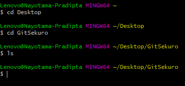
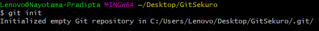
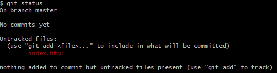
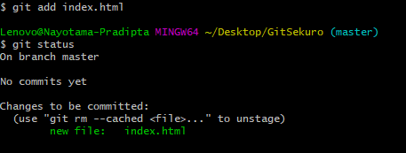
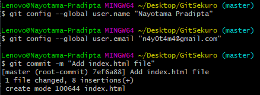
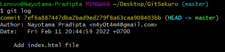

# Working with Git 

Git sebenarnya punya GUI bernama Git Client akan tetapi tidak akan mengajarkan konsep Git secara dalam. <br>

Untuk menggunakan git, maka install git terlebih dahulu. Untuk mengecek apakah git sudah ter<i>install</i>, maka kita dapat menjalankan command berikut di terminal:
```shell
git 
```
Hasil prompt seharusnya kurang lebih sebagai berikut: <hr>


Area pada repo Git ada 3: 
1. Working Tree
2. Staging Area 
3. History

Staging Area dan history akan tersimpan di dalam folder .git 

Ketika melakukan git add, maka area akan berubah dari working tree menjadi staging area dan ketika melakukan git commit, maka area akan berubah dari staging area menjadi history. 

Untuk memulai sebuah projek, kita harus membuat folder terlebih dahulu. Kemudian di dalam command prompt/terminal/git bash, kita perlu masuk ke directory folder tersebut. <br> Sebagai contoh, saya telah membuat folder bernama 'GitSekuro' di Desktop yang masih kosong: <br><br>
 <br>

Untuk mengubah folder biasa menjadi repo git, maka perlu menuliskan command berikut: <br>
```shell
git init
```
Tampilan di Git Bash: <br>
 <br>

Ketika kita membuka folder tersebut dan memperlihatkan semua hidden files, akan tampil folder bernama .git <br>

Pada saat kita membuat file baru di dalam folder dan melakukan save, save ini hanya berlaku pada file system saja, belum berlaku pada git. Untuk melihat perubahan yang terjadi, kita dapat menuliskan command berikut: 
```shell
git status
```
Berikut screenshot hasil prompt: <br>
<br>
Tampak bahwa terdapat file yang masih dalam status "Untracked"


Untuk melakukan commit, file harus disimpan di dalam staging area menggunakan command berikut:
```shell
git add <file_name>
```
Contohnya sebagai berikut: <br>


Sebelum commit pertama kali, lakukan command berikut:

```shell 
git config --global user.email "you@example.com"
git config --global user.name "Your Name"
```
Selanjutnya lakukan commit dengan menuliskan:
```shell
git commit -m <"commit message">
```
Contohnya sebagai berikut: <br>


Ketika kita ingin memodifikasi file lagi, maka semua file yang termodifikasi harus dimasukkan terlebih dahulu ke staging area. Hal ini juga berlaku ketika ada penghapusan file. Untuk add semua file sekaligus, digunakan command sebagai berikut: 
```shell
git add . 
```

Untuk melihat semua perubahan yang telah dilakukan, dapat menggunakan command berikut: 
```shell
git log 
```
Git log juga dapat digunakan secara lebih spesifik, seperti melihat N perubahan terbaru, maka: 
```shell
git log -N
```
Untuk melihat semua perubahan terkait file X.filetype, maka:
```shell
git log -- X.filetype
```
Berikut contoh tampilan ```git log```: <br><br>
