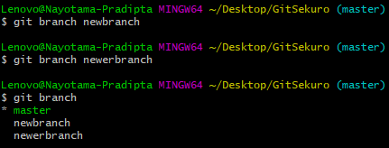
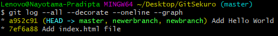
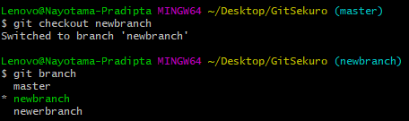
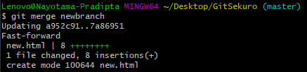

# Git Branch

IDE Visual Studio Code memiliki Source Control sendiri sehingga programmer/developer dapat melakukan add, commit, push, pull dengan jauh lebih mudah 

Di dalam sebuah commit, terdapat hash, username, email, dan timestamp. Selain itu commit terhubung dengan sebuah branch. Secara default, nama branch utama adalah master. Untuk menentukan branch yang aktif, git memiliki pointer bernama head. Ketika ada commit baru, maka pointer head juga akan berubah. 

Untuk melakukan branch dengan git, command yang digunakan adalah:
```shell
git branch <nama_branch>
```
Di dalam commit yang sama, maka akan ada tambahan branch.
Untuk melihat semua branch pada suatu commit, maka tuliskan:
```shell
git branch
```
Contoh tampilan adalah sebagai berikut:
 <br>

Untuk memvisualisasikan perubahan yang ada, gunakan command berikut:
```shell
git log --all --decorate --online --graph
```
Seperti berikut: <br>


Kita juga dapat membuat alias untuk memperpendek suatu command panjang yang sering digunakan menggunakan perintah: 
```shell
alias <alias_name>=<"command yang panjang">
```
Contoh:
```shell
alias graph="git log --all --decorate --online --graph"
```

Untuk pindah ke branch yang lain, gunakan perintah: 
```shell
git checkout <branch_name>
```
Command ini akan menyebabkan head pointer berpindah ke <branch_name>. Pada saat commit baru dilakukan, maka yang berpindah adalah branch beserta head pointernya. Berikut contohnya:
 <br>

Untuk melakukan commit, caranya sama dengan yang telah dijelaskan di rangkuman 5, yaitu:
```shell
git add .
git commit -m <"commit message">
``` 

Setelah semua branch dirasa sudah siap untuk digabungkan ke branch utama (master), maka dilakukan merge. Ada dua jenis merge:
1. Fast Forward: Terjadi ketika branch yang ingin di-merge berada di direct path. Ketika merge dilakukan, branch master akan maju ke branch baru yang dimerge. 
2. Three-Way Merge: Terjadi ketika merge dilakukan terhadap dua branch yang tidak memiliki direct path. Hasil akhirnya adalah commit baru, sehingga dinamakan merge commit 

Merge dilakukan dengan command: 
```shell
git checkout master /* Jika belum ada di master */
git merge <branch_name>
```
Contoh: <br>
 <br>

Untuk menghapus branch, lakukan perintah: 
```shell
git branch -d <branch_name>
```
Contoh:
```shell
git branch -d newbranch
```
Branch yang dapat di-delete hanyalah yang sudah di merge <br>

Untuk melakukan delete pada branch yang belum di merge, maka digunakan: 
```shell
git branch -D <branch_name>
```

Untuk melakukan three way merge, perintah yang digunakan adalah: 
```shell
git checkout master /* Jika belum ada di master */
git merge <branch_name>
```
Git akan mengarahkan ke IDE, dalam hal ini VIM
Ketika di dalam VIM, maka ketik 
```shell
:wq!
```
untuk keluar dan save perubahannya